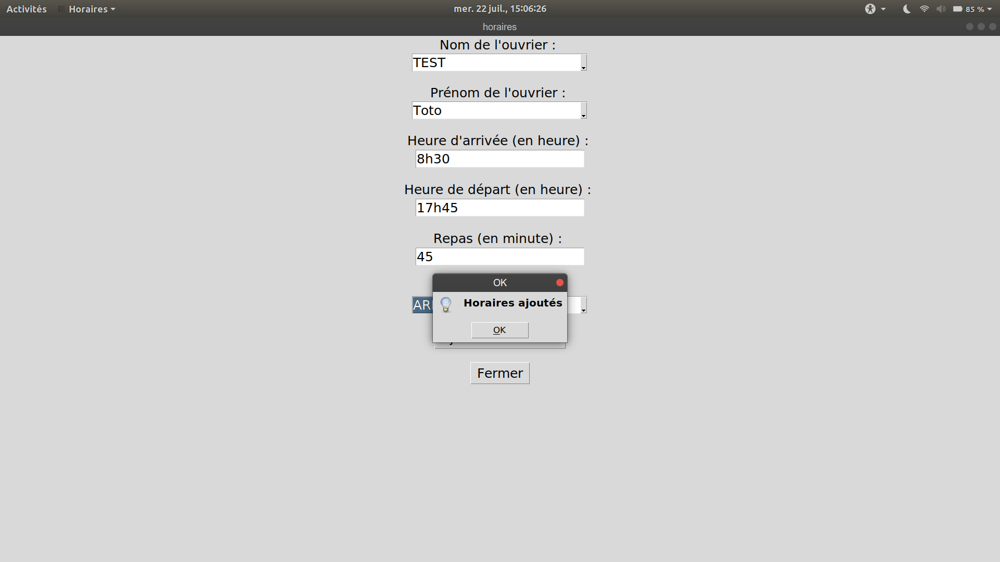
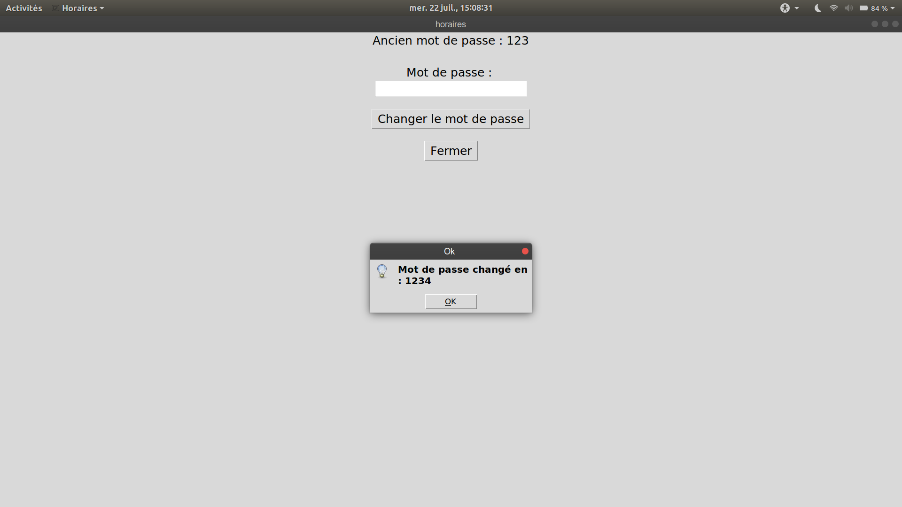

# Work Hours Project

I did it during my 3rd year of university license. This is a client project, and is developed in Python3. This project is finished.

The client is an entrepreneur. His request was to do a program that make sum of number of work hours and MG (kilometer allowances), because the client take 2 days to do the pay slip, and he wanted save time.

So, this project do the sum of number of work hours and MG, and it send it by email, to the saved email of client, every 1st of month.

## How work

The client don't have much workers, so I think a database system of file is enought. It's why I did it in python, because I think it's a good programmation language to work with files.

So, you need to have a file where save the workers' name and firstname, the work hours of workers, and citys and her MG.

You need to a file where save the client's password and email.

## To begin
Do the command :  `$ git clone https://github.com/debroucker/work_hours_project.git` to recover this repository.

## Prerequisite
You need to have Python3.
So, if you haven't it, do the command : `$ sudo apt-get install python3` .

To send an email, you need to have an gmail adress, without double authentication, and give acces at others applications to use your email.

You need to let the programm run, without stop it, because, it check every hour to send the email with the work hours.

## Start-up
To launch the game, do the command : `$ python3 app/mainGraphic.py` in the main directory.

### home screen :

### authentication by password :

### bad password :

### add worker :

### add work hours :

### show work hours :

### edit password :

### edit email :

### forget password :

### email forget password :

## Made with
Visual Studio Code

## Authors
DEBROUCKER Tommy

